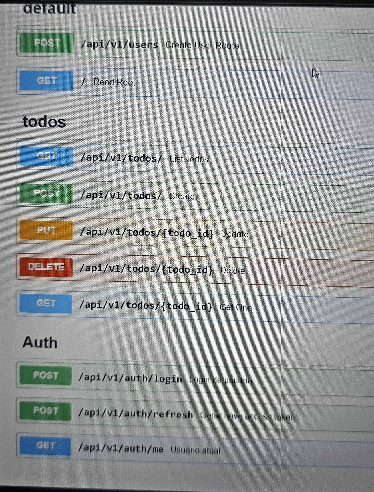

# 🚀 FastAPI Todo API

API de gerenciamento de tarefas (To-Do) com autenticação JWT.

## 📌 Funcionalidades

- Cadastro de usuário
- Login com JWT (access + refresh token)
- CRUD de tarefas (protegido por autenticação)
- Refresh de token
- Documentação automática com Swagger

---

## 📸 Documentação da API (Swagger)

Interface interativa gerada automaticamente pelo FastAPI para testar os endpoints.



## 🛠️ Tecnologias

- Python
- FastAPI
- SQLAlchemy
- SQLite
- JWT (auth)

---

## ⚙️ Como rodar o projeto

### 1. Clone o repositório

```bash
git clone https://github.com/seu-usuario/seu-repo.git
cd fastapi_project
2. Crie o arquivo .env
Bash
Copiar código
cp .env.example .env
Preencha com seus valores.
3. Crie o ambiente virtual
Bash
Copiar código
python -m venv venv
venv\Scripts\activate  # Windows
4. Instale as dependências
Bash
Copiar código
pip install -r requirements.txt
5. Rode o projeto
Bash
Copiar código
uvicorn app.main:app --reload
📖 Documentação da API
Acesse:
Copiar código

http://127.0.0.1:8000/docs
🔐 Autenticação
Login retorna:
access_token
refresh_token
Use o botão Authorize no Swagger
📂 Estrutura do projeto
Copiar código

app/
├── api/
├── core/
├── models/
├── schemas/
├── services/
📌 Melhorias futuras
Testes automatizados
Deploy
Integração com frontend (React)
